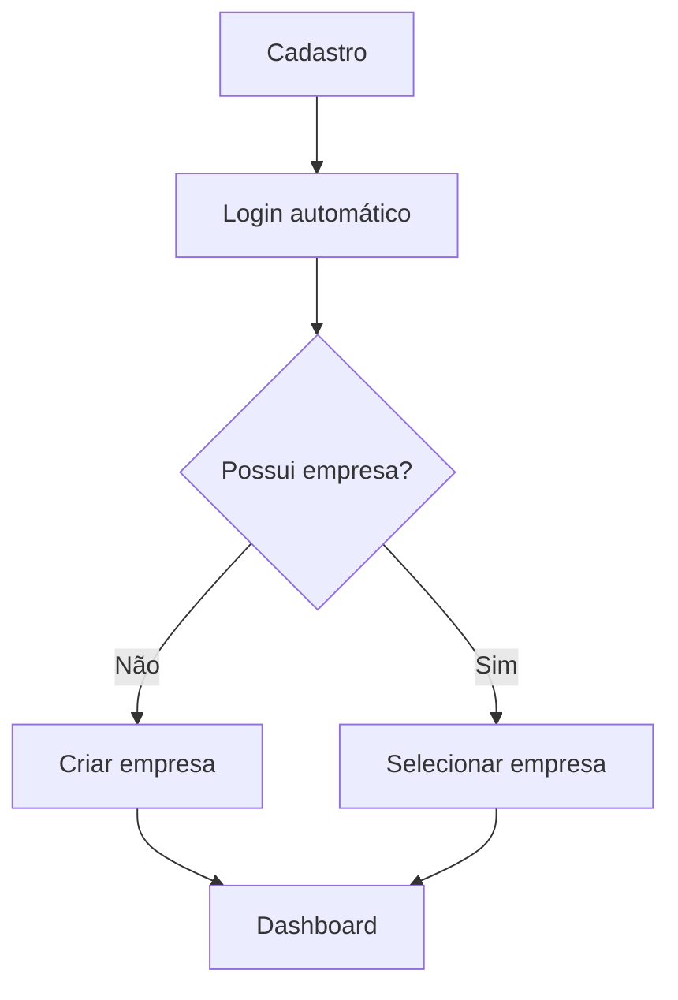
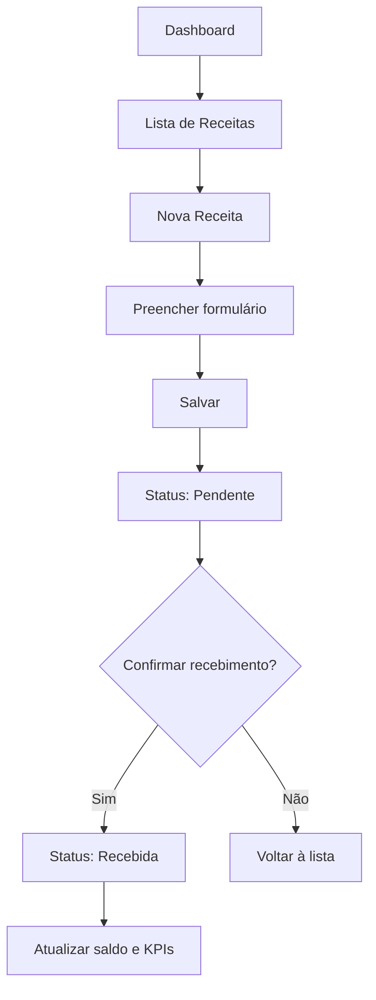
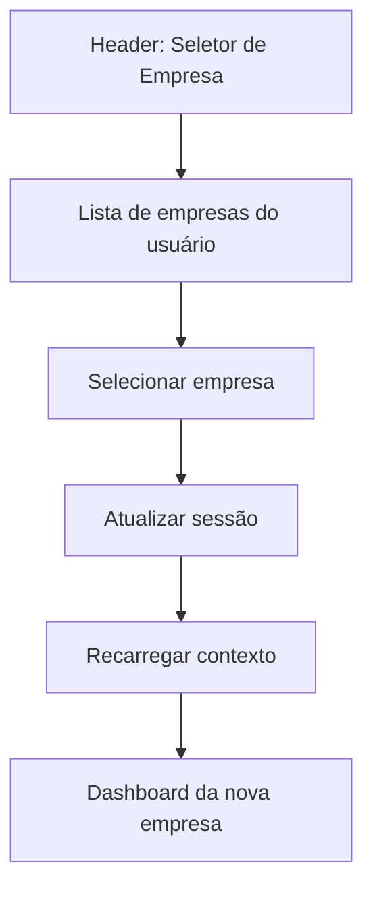
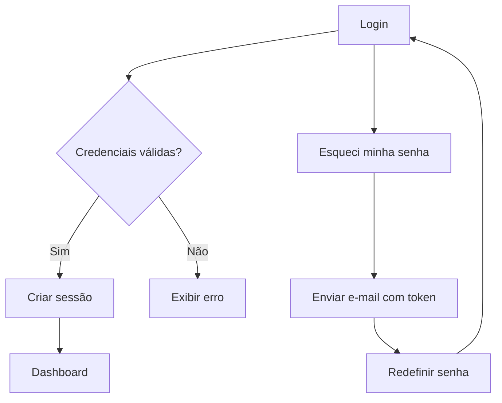

# Monetra — Information Architecture

> **Versão:** 1.0.0  
> **Status:** Draft  
> **Última atualização:** 07/07/2026

---

# Objetivo

Este documento define a arquitetura de informação do Monetra: estrutura de navegação, hierarquia de páginas, rotas, fluxos de usuário e organização de conteúdo por persona.

Serve como base para wireframes, design de interface e implementação de rotas no Next.js App Router.

---

# Princípios de IA

1. **Dashboard como hub** — após login, o usuário chega ao dashboard.
2. **Navegação por domínio** — sidebar organizada por módulos de negócio.
3. **Poucos cliques** — registrar movimentação em no máximo 3 cliques.
4. **Contexto organizacional** — empresa ativa sempre visível no header.
5. **Progressive disclosure** — informações avançadas em subpáginas ou modais.
6. **Consistência** — padrões de listagem, formulário e detalhe em todos os módulos.

---

# Mapa do Site

```text
Monetra
│
├── Público
│   ├── /                          Landing (futuro)
│   ├── /login                     Login
│   ├── /register                  Cadastro
│   ├── /forgot-password           Recuperar senha
│   └── /reset-password/[token]    Redefinir senha
│
├── Onboarding
│   └── /onboarding/company        Criar primeira empresa
│
├── Autenticado (App Shell)
│   ├── /dashboard                 Dashboard principal
│   │
│   ├── /financial
│   │   ├── /revenues              Lista de receitas
│   │   ├── /revenues/new          Nova receita
│   │   ├── /revenues/[id]         Detalhe / editar receita
│   │   ├── /expenses              Lista de despesas
│   │   ├── /expenses/new          Nova despesa
│   │   ├── /expenses/[id]         Detalhe / editar despesa
│   │   ├── /cash-flow             Fluxo de caixa
│   │   └── /categories            Categorias
│   │
│   ├── /crm
│   │   ├── /customers             Clientes
│   │   ├── /customers/new         Novo cliente
│   │   ├── /customers/[id]        Detalhe do cliente
│   │   ├── /suppliers             Fornecedores
│   │   ├── /suppliers/new         Novo fornecedor
│   │   └── /suppliers/[id]        Detalhe do fornecedor
│   │
│   ├── /analytics
│   │   ├── /reports               Relatórios
│   │   └── /reports/[type]        Relatório específico
│   │
│   ├── /organization
│   │   ├── /members               Membros da equipe
│   │   └── /invites               Convites pendentes
│   │
│   └── /settings
│       ├── /profile               Perfil do usuário
│       ├── /company               Dados da empresa
│       └── /preferences           Tema e preferências
│
└── API
    └── /api/v1/...                Route Handlers REST
```

---

# Estrutura de Rotas (Next.js)

## Rotas públicas

| Rota                      | Página                                       | Descrição           |
| ------------------------- | -------------------------------------------- | ------------------- |
| `/login`                  | `app/(auth)/login/page.tsx`                  | Formulário de login |
| `/register`               | `app/(auth)/register/page.tsx`               | Cadastro de usuário |
| `/forgot-password`        | `app/(auth)/forgot-password/page.tsx`        | Solicitar reset     |
| `/reset-password/[token]` | `app/(auth)/reset-password/[token]/page.tsx` | Nova senha          |

## Rotas autenticadas (App Shell)

Layout compartilhado: `app/(app)/layout.tsx` com sidebar, header e seletor de empresa.

| Grupo              | Layout               | Middleware                 |
| ------------------ | -------------------- | -------------------------- |
| `(auth)`           | Minimal, sem sidebar | Redireciona se autenticado |
| `(app)`            | Sidebar + header     | Requer autenticação        |
| `(app)/onboarding` | Sem sidebar          | Requer auth, sem empresa   |

---

# Navegação Principal (Sidebar)

```text
┌─────────────────────────────┐
│  [Logo] Monetra             │
│  [Seletor de Empresa ▼]     │
├─────────────────────────────┤
│  📊 Dashboard               │
│                             │
│  FINANCEIRO                 │
│  ├── Receitas               │
│  ├── Despesas               │
│  ├── Fluxo de Caixa         │
│  └── Categorias             │
│                             │
│  RELACIONAMENTO             │
│  ├── Clientes               │
│  └── Fornecedores           │
│                             │
│  ANÁLISE                    │
│  └── Relatórios             │
│                             │
│  ORGANIZAÇÃO                │
│  ├── Membros                │
│  └── Convites               │
│                             │
│  CONFIGURAÇÕES              │
│  ├── Perfil                 │
│  ├── Empresa                │
│  └── Preferências           │
├─────────────────────────────┤
│  [Avatar] Nome do Usuário   │
│  [Logout]                   │
└─────────────────────────────┘
```

## Visibilidade por papel (RBAC)

| Item de menu            | OWNER | ADMIN | MEMBER | VIEWER |
| ----------------------- | :---: | :---: | :----: | :----: |
| Dashboard               |  ✅   |  ✅   |   ✅   |   ✅   |
| Receitas / Despesas     |  ✅   |  ✅   |   ✅   |   👁️   |
| Fluxo de Caixa          |  ✅   |  ✅   |   ✅   |   👁️   |
| Categorias              |  ✅   |  ✅   |   👁️   |   👁️   |
| Clientes / Fornecedores |  ✅   |  ✅   |   ✅   |   👁️   |
| Relatórios              |  ✅   |  ✅   |   ✅   |   ✅   |
| Membros / Convites      |  ✅   |  ✅   |   ❌   |   ❌   |
| Config. Empresa         |  ✅   |  ✅   |   ❌   |   ❌   |
| Perfil / Preferências   |  ✅   |  ✅   |   ✅   |   ✅   |

👁️ = somente leitura

---

# Header da Aplicação

```text
┌──────────────────────────────────────────────────────────┐
│ [≡]  Empresa Ativa ▼  │  Breadcrumb: Financeiro > Receitas  │  [🔔] [Avatar ▼] │
└──────────────────────────────────────────────────────────┘
```

**Elementos:**

- Toggle sidebar (mobile)
- Seletor de empresa (multi-tenant)
- Breadcrumbs contextuais
- Notificações (V1)
- Menu do usuário (perfil, logout)

---

# Fluxos de Usuário

## Fluxo 1 — Onboarding (primeiro acesso)



**Passos:**

1. Usuário se cadastra em `/register`.
2. Sistema autentica e redireciona para `/onboarding/company`.
3. Usuário preenche nome, moeda e timezone.
4. Sistema cria empresa, atribui papel Owner e redireciona para `/dashboard`.

---

## Fluxo 2 — Registrar receita



**Campos do formulário:**

- Valor (obrigatório)
- Categoria (obrigatório, tipo receita)
- Data (obrigatório)
- Cliente (opcional)
- Descrição (opcional)

---

## Fluxo 3 — Trocar empresa ativa



**Regras:**

- Dados exibidos sempre da empresa selecionada.
- Última empresa ativa persistida na sessão.
- Troca não requer novo login.

---

## Fluxo 4 — Login e recuperação de senha



---

# Hierarquia de Informação por Persona

## Owner (Proprietário)

**Página inicial:** Dashboard com KPIs executivos.

**Prioridade de informação:**

1. Saldo em caixa
2. Lucro do mês
3. Contas vencidas
4. Evolução receita x despesa
5. Ações rápidas (nova receita, nova despesa)

**Acesso completo** a todos os módulos.

---

## Financial Manager (Responsável Financeiro)

**Página inicial:** Dashboard com foco em movimentações.

**Prioridade de informação:**

1. Lançamentos pendentes (receber/pagar)
2. Fluxo de caixa do período
3. Contas vencendo esta semana
4. Atalhos para novo lançamento

**Operacional:** cria e edita lançamentos, gerencia clientes e fornecedores.

---

## Employee (Funcionário / Member)

**Página inicial:** Dashboard simplificado.

**Prioridade de informação:**

1. Lançamentos do dia
2. Formulário rápido de registro
3. Lista de pendências

**Acesso limitado:** sem gestão de membros ou configurações da empresa.

---

## Accountant (Contador / Viewer)

**Página inicial:** Dashboard + Relatórios.

**Prioridade de informação:**

1. Relatórios financeiros por período
2. Exportação de dados
3. Visão consolidada de categorias

**Somente leitura** em lançamentos; foco em exportação e análise.

---

# Padrões de Página

## Listagem

```text
┌─────────────────────────────────────────┐
│ Título da Página          [+ Novo]      │
├─────────────────────────────────────────┤
│ [Filtros] [Busca] [Período]              │
├─────────────────────────────────────────┤
│ Tabela / Cards com paginação            │
│ ├── Coluna principal                    │
│ ├── Status (badge)                      │
│ ├── Valor (formatado BRL)               │
│ └── Ações (editar, excluir)             │
├─────────────────────────────────────────┤
│ Paginação: < 1 2 3 ... 10 >             │
└─────────────────────────────────────────┘
```

## Formulário

```text
┌─────────────────────────────────────────┐
│ Título: Nova Receita                    │
├─────────────────────────────────────────┤
│ [Campos do formulário]                  │
│                                         │
│ [Cancelar]              [Salvar]        │
└─────────────────────────────────────────┘
```

## Detalhe

```text
┌─────────────────────────────────────────┐
│ Título: Receita #123    [Editar] [···]  │
├─────────────────────────────────────────┤
│ Informações principais                  │
│ Histórico / Auditoria (V1)              │
│ Anexos (V1)                             │
└─────────────────────────────────────────┘
```

## Empty State

Exibido quando não há dados:

```text
┌─────────────────────────────────────────┐
│         [Ilustração]                    │
│   Nenhuma receita cadastrada            │
│   Comece registrando sua primeira       │
│   receita para acompanhar o caixa.      │
│         [+ Nova Receita]                │
└─────────────────────────────────────────┘
```

---

# Breadcrumbs

| Página          | Breadcrumb                   |
| --------------- | ---------------------------- |
| Dashboard       | Dashboard                    |
| Receitas        | Financeiro > Receitas        |
| Nova receita    | Financeiro > Receitas > Nova |
| Detalhe receita | Financeiro > Receitas > #123 |
| Clientes        | Relacionamento > Clientes    |
| Relatórios      | Análise > Relatórios         |
| Membros         | Organização > Membros        |
| Perfil          | Configurações > Perfil       |

---

# Ações Contextuais

## Dashboard — Quick Actions

| Ação         | Destino                   | Atalho           |
| ------------ | ------------------------- | ---------------- |
| Nova Receita | `/financial/revenues/new` | Botão primário   |
| Nova Despesa | `/financial/expenses/new` | Botão secundário |
| Novo Cliente | `/crm/customers/new`      | Menu dropdown    |

## Lista de lançamentos — Row Actions

| Ação                            | Condição       | Papel mínimo |
| ------------------------------- | -------------- | ------------ |
| Editar                          | Sempre         | MEMBER       |
| Confirmar recebimento/pagamento | Status PENDING | MEMBER       |
| Excluir                         | Sempre         | ADMIN        |
| Arquivar                        | V1             | MEMBER       |

---

# Responsividade

## Desktop (≥ 1024px)

- Sidebar fixa à esquerda (240px).
- Conteúdo principal com max-width 1280px.
- Tabelas com todas as colunas visíveis.

## Tablet (768px – 1023px)

- Sidebar colapsável (ícones apenas).
- Tabelas com colunas essenciais.
- Formulários em coluna única.

## Mobile (< 768px)

- Sidebar como drawer (overlay).
- Bottom navigation para módulos principais (Dashboard, Receitas, Despesas, Mais).
- Formulários full-width.
- Cards em vez de tabelas.

---

# Metadados de Página

Cada página deve definir:

```typescript
export const metadata: Metadata = {
  title: "Receitas | Monetra",
  description: "Gerencie as receitas da sua empresa",
};
```

Título padrão: `{Página} | Monetra`.

---

# Referências

- [04-personas.md](04-personas.md)
- [05-user-stories.md](05-user-stories.md)
- [06-business-rules.md](06-business-rules.md)
- [11-design-system.md](11-design-system.md)
- [08-software-architecture.md](08-software-architecture.md)
