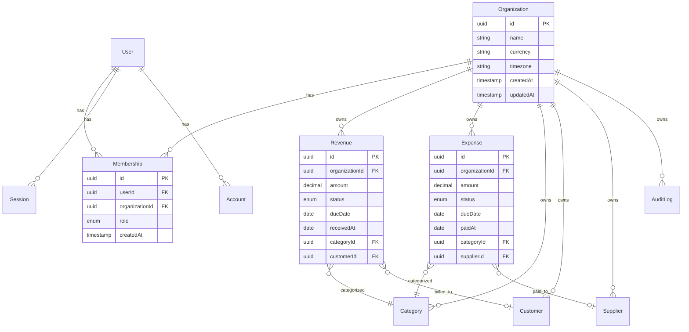

# Monetra — Database Design

> **Versão:** 1.0.0  
> **Status:** Draft  
> **Última atualização:** 07/07/2026

---

# Objetivo

Este documento define o modelo de dados do Monetra: estratégia multi-tenant, diagrama entidade-relacionamento, tabelas, tipos, constraints, índices e esboço do schema Prisma.

---

# Estratégia Multi-tenant

O Monetra utiliza **shared database, shared schema** com isolamento por `organizationId`.

## Regras

- Toda tabela de negócio possui coluna `organizationId`.
- Toda query filtra por `organizationId` da sessão ativa.
- Tabelas globais (users, sessions) não possuem `organizationId`.
- Membership conecta users a organizations com papel (RBAC).

```text
User ──< Membership >── Organization
                              │
                              ├── Revenue
                              ├── Expense
                              ├── Category
                              ├── Customer
                              └── Supplier
```

---

# Diagrama ER



---

# Tabelas por Domínio

## Identity & Access

### users

| Coluna        | Tipo         | Constraints                   |
| ------------- | ------------ | ----------------------------- |
| id            | UUID         | PK, default gen_random_uuid() |
| name          | VARCHAR(255) | NOT NULL                      |
| email         | VARCHAR(255) | NOT NULL, UNIQUE              |
| passwordHash  | VARCHAR(255) | NOT NULL                      |
| image         | VARCHAR(500) | NULL                          |
| emailVerified | TIMESTAMP    | NULL                          |
| createdAt     | TIMESTAMP    | NOT NULL, default now()       |
| updatedAt     | TIMESTAMP    | NOT NULL                      |

**Índices:** `UNIQUE(email)`

### sessions (Auth.js)

| Coluna       | Tipo         | Constraints             |
| ------------ | ------------ | ----------------------- |
| id           | UUID         | PK                      |
| sessionToken | VARCHAR(255) | NOT NULL, UNIQUE        |
| userId       | UUID         | FK → users.id, NOT NULL |
| expires      | TIMESTAMP    | NOT NULL                |

### accounts (Auth.js — OAuth futuro)

| Coluna            | Tipo         | Constraints   |
| ----------------- | ------------ | ------------- |
| id                | UUID         | PK            |
| userId            | UUID         | FK → users.id |
| provider          | VARCHAR(50)  | NOT NULL      |
| providerAccountId | VARCHAR(255) | NOT NULL      |

### verification_tokens (Auth.js)

| Coluna     | Tipo         | Constraints      |
| ---------- | ------------ | ---------------- |
| identifier | VARCHAR(255) | NOT NULL         |
| token      | VARCHAR(255) | NOT NULL, UNIQUE |
| expires    | TIMESTAMP    | NOT NULL         |

---

## Organization

### organizations

| Coluna    | Tipo         | Constraints                           |
| --------- | ------------ | ------------------------------------- |
| id        | UUID         | PK                                    |
| name      | VARCHAR(255) | NOT NULL                              |
| currency  | VARCHAR(3)   | NOT NULL, default 'BRL'               |
| timezone  | VARCHAR(50)  | NOT NULL, default 'America/Sao_Paulo' |
| logo      | VARCHAR(500) | NULL                                  |
| createdAt | TIMESTAMP    | NOT NULL                              |
| updatedAt | TIMESTAMP    | NOT NULL                              |

### memberships

| Coluna         | Tipo      | Constraints                             |
| -------------- | --------- | --------------------------------------- |
| id             | UUID      | PK                                      |
| userId         | UUID      | FK → users.id, NOT NULL                 |
| organizationId | UUID      | FK → organizations.id, NOT NULL         |
| role           | ENUM      | NOT NULL (OWNER, ADMIN, MEMBER, VIEWER) |
| createdAt      | TIMESTAMP | NOT NULL                                |
| updatedAt      | TIMESTAMP | NOT NULL                                |

**Índices:** `UNIQUE(userId, organizationId)`, `INDEX(organizationId)`

### invitations (V1)

| Coluna         | Tipo         | Constraints  |
| -------------- | ------------ | ------------ |
| id             | UUID         | PK           |
| organizationId | UUID         | FK, NOT NULL |
| email          | VARCHAR(255) | NOT NULL     |
| role           | ENUM         | NOT NULL     |
| token          | VARCHAR(255) | UNIQUE       |
| expiresAt      | TIMESTAMP    | NOT NULL     |
| acceptedAt     | TIMESTAMP    | NULL         |

---

## Financial

### categories

| Coluna         | Tipo         | Constraints                 |
| -------------- | ------------ | --------------------------- |
| id             | UUID         | PK                          |
| organizationId | UUID         | FK, NOT NULL                |
| name           | VARCHAR(100) | NOT NULL                    |
| type           | ENUM         | NOT NULL (REVENUE, EXPENSE) |
| isDefault      | BOOLEAN      | default false               |
| archivedAt     | TIMESTAMP    | NULL                        |
| createdAt      | TIMESTAMP    | NOT NULL                    |

**Índices:** `UNIQUE(organizationId, name, type)`, `INDEX(organizationId, type)`

### revenues

| Coluna         | Tipo          | Constraints                             |
| -------------- | ------------- | --------------------------------------- |
| id             | UUID          | PK                                      |
| organizationId | UUID          | FK, NOT NULL                            |
| amount         | DECIMAL(15,2) | NOT NULL, CHECK > 0                     |
| description    | TEXT          | NULL                                    |
| status         | ENUM          | NOT NULL (PENDING, RECEIVED, CANCELLED) |
| dueDate        | DATE          | NOT NULL                                |
| receivedAt     | DATE          | NULL                                    |
| categoryId     | UUID          | FK → categories.id, NOT NULL            |
| customerId     | UUID          | FK → customers.id, NULL                 |
| createdBy      | UUID          | FK → users.id                           |
| deletedAt      | TIMESTAMP     | NULL                                    |
| createdAt      | TIMESTAMP     | NOT NULL                                |
| updatedAt      | TIMESTAMP     | NOT NULL                                |

**Índices:** `INDEX(organizationId, status)`, `INDEX(organizationId, dueDate)`

### expenses

| Coluna         | Tipo          | Constraints                         |
| -------------- | ------------- | ----------------------------------- |
| id             | UUID          | PK                                  |
| organizationId | UUID          | FK, NOT NULL                        |
| amount         | DECIMAL(15,2) | NOT NULL, CHECK > 0                 |
| description    | TEXT          | NULL                                |
| status         | ENUM          | NOT NULL (PENDING, PAID, CANCELLED) |
| dueDate        | DATE          | NOT NULL                            |
| paidAt         | DATE          | NULL                                |
| categoryId     | UUID          | FK → categories.id, NOT NULL        |
| supplierId     | UUID          | FK → suppliers.id, NULL             |
| createdBy      | UUID          | FK → users.id                       |
| deletedAt      | TIMESTAMP     | NULL                                |
| createdAt      | TIMESTAMP     | NOT NULL                            |
| updatedAt      | TIMESTAMP     | NOT NULL                            |

**Índices:** `INDEX(organizationId, status)`, `INDEX(organizationId, dueDate)`

### recurring_transactions (V1)

| Coluna         | Tipo          | Constraints             |
| -------------- | ------------- | ----------------------- |
| id             | UUID          | PK                      |
| organizationId | UUID          | FK, NOT NULL            |
| type           | ENUM          | REVENUE, EXPENSE        |
| amount         | DECIMAL(15,2) | NOT NULL                |
| frequency      | ENUM          | WEEKLY, MONTHLY, YEARLY |
| nextDueDate    | DATE          | NOT NULL                |
| isActive       | BOOLEAN       | default true            |
| templateData   | JSONB         | dados do lançamento     |

---

## CRM

### customers

| Coluna         | Tipo         | Constraints  |
| -------------- | ------------ | ------------ |
| id             | UUID         | PK           |
| organizationId | UUID         | FK, NOT NULL |
| name           | VARCHAR(255) | NOT NULL     |
| email          | VARCHAR(255) | NULL         |
| phone          | VARCHAR(20)  | NULL         |
| document       | VARCHAR(20)  | NULL         |
| archivedAt     | TIMESTAMP    | NULL         |
| createdAt      | TIMESTAMP    | NOT NULL     |
| updatedAt      | TIMESTAMP    | NOT NULL     |

**Índices:** `INDEX(organizationId)`, `UNIQUE(organizationId, LOWER(name))` WHERE archivedAt IS NULL

### suppliers

| Coluna         | Tipo         | Constraints  |
| -------------- | ------------ | ------------ |
| id             | UUID         | PK           |
| organizationId | UUID         | FK, NOT NULL |
| name           | VARCHAR(255) | NOT NULL     |
| email          | VARCHAR(255) | NULL         |
| phone          | VARCHAR(20)  | NULL         |
| document       | VARCHAR(20)  | NULL         |
| archivedAt     | TIMESTAMP    | NULL         |
| createdAt      | TIMESTAMP    | NOT NULL     |
| updatedAt      | TIMESTAMP    | NOT NULL     |

---

## Platform

### audit_logs

| Coluna         | Tipo        | Constraints   |
| -------------- | ----------- | ------------- |
| id             | UUID        | PK            |
| organizationId | UUID        | FK, NOT NULL  |
| userId         | UUID        | FK → users.id |
| action         | VARCHAR(50) | NOT NULL      |
| entity         | VARCHAR(50) | NOT NULL      |
| entityId       | UUID        | NULL          |
| metadata       | JSONB       | NULL          |
| ip             | VARCHAR(45) | NULL          |
| createdAt      | TIMESTAMP   | NOT NULL      |

**Índices:** `INDEX(organizationId, createdAt)`, `INDEX(entity, entityId)`

---

# Enums

```prisma
enum Role {
  OWNER
  ADMIN
  MEMBER
  VIEWER
}

enum CategoryType {
  REVENUE
  EXPENSE
}

enum RevenueStatus {
  PENDING
  RECEIVED
  CANCELLED
}

enum ExpenseStatus {
  PENDING
  PAID
  CANCELLED
}

enum RecurrenceFrequency {
  WEEKLY
  MONTHLY
  YEARLY
}
```

---

# Esboço Prisma Schema

```prisma
// prisma/schema.prisma

generator client {
  provider = "prisma-client-js"
}

datasource db {
  provider = "postgresql"
  url      = env("DATABASE_URL")
}

model User {
  id            String       @id @default(uuid())
  name          String
  email         String       @unique
  passwordHash  String
  image         String?
  emailVerified DateTime?
  createdAt     DateTime     @default(now())
  updatedAt     DateTime     @updatedAt

  memberships   Membership[]
  sessions      Session[]
  accounts      Account[]
}

model Organization {
  id        String   @id @default(uuid())
  name      String
  currency  String   @default("BRL")
  timezone  String   @default("America/Sao_Paulo")
  logo      String?
  createdAt DateTime @default(now())
  updatedAt DateTime @updatedAt

  memberships Membership[]
  revenues    Revenue[]
  expenses    Expense[]
  categories  Category[]
  customers   Customer[]
  suppliers   Supplier[]
  auditLogs   AuditLog[]
}

model Membership {
  id             String       @id @default(uuid())
  userId         String
  organizationId String
  role           Role         @default(MEMBER)
  createdAt      DateTime     @default(now())
  updatedAt      DateTime     @updatedAt

  user         User         @relation(fields: [userId], references: [id])
  organization Organization @relation(fields: [organizationId], references: [id])

  @@unique([userId, organizationId])
  @@index([organizationId])
}

model Revenue {
  id             String        @id @default(uuid())
  organizationId String
  amount         Decimal       @db.Decimal(15, 2)
  description    String?
  status         RevenueStatus @default(PENDING)
  dueDate        DateTime      @db.Date
  receivedAt     DateTime?     @db.Date
  categoryId     String
  customerId     String?
  createdBy      String?
  deletedAt      DateTime?
  createdAt      DateTime      @default(now())
  updatedAt      DateTime      @updatedAt

  organization Organization @relation(fields: [organizationId], references: [id])
  category     Category     @relation(fields: [categoryId], references: [id])
  customer     Customer?    @relation(fields: [customerId], references: [id])

  @@index([organizationId, status])
  @@index([organizationId, dueDate])
}

// ... demais modelos seguem o mesmo padrão
```

---

# Mapeamento Domínio → Tabela

| Entidade (Domínio) | Tabela        | Domínio      |
| ------------------ | ------------- | ------------ |
| User               | users         | Identity     |
| Session            | sessions      | Identity     |
| Company            | organizations | Organization |
| Membership         | memberships   | Organization |
| Revenue            | revenues      | Financial    |
| Expense            | expenses      | Financial    |
| Category           | categories    | Financial    |
| Customer           | customers     | CRM          |
| Supplier           | suppliers     | CRM          |
| AuditLog           | audit_logs    | Platform     |

---

# Migrations

## Convenções

- Uma migration por alteração lógica.
- Nome descritivo: `20260707_create_organizations`.
- Nunca editar migrations já aplicadas.
- Rodar `npx prisma migrate dev` em desenvolvimento.
- Rodar `npx prisma migrate deploy` em produção.

## Comandos

```bash
npx prisma migrate dev --name <nome>
npx prisma migrate deploy
npx prisma db seed
npx prisma studio
```

---

# Seeding

Dados iniciais para desenvolvimento:

1. Usuário admin de teste.
2. Organização de exemplo.
3. Categorias padrão (receita e despesa).
4. Lançamentos de exemplo para dashboard.

Arquivo: `prisma/seed.ts`

---

# Regras de Integridade

| Regra                         | Implementação                            |
| ----------------------------- | ---------------------------------------- |
| RN-FIN-003 Saldo derivado     | Sem coluna `balance`; calcular via query |
| RN-GLOBAL-001 Isolamento      | `organizationId` em toda FK de negócio   |
| RN-FIN-005 Categoria por tipo | FK + validação no domínio                |
| Soft delete                   | Campo `deletedAt` / `archivedAt`         |
| Auditoria                     | Tabela `audit_logs` append-only          |

---

# Performance

- Índices compostos em `(organizationId, status)` e `(organizationId, dueDate)`.
- Paginação cursor-based para listagens grandes.
- Evitar N+1 com `include` seletivo no Prisma.
- Consultas de dashboard podem usar views materializadas (V2).

---

# Referências

- [03-domain-model.md](03-domain-model.md)
- [06-business-rules.md](06-business-rules.md)
- [08-software-architecture.md](08-software-architecture.md)
- [adr/ADR-002-postgresql.md](adr/ADR-002-postgresql.md)
- [adr/ADR-003-prisma.md](adr/ADR-003-prisma.md)
