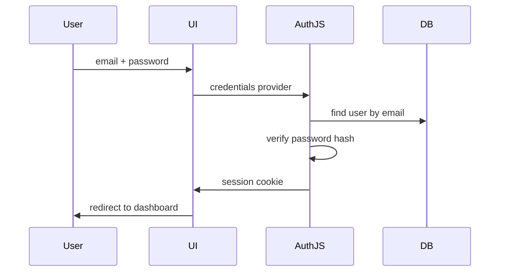

# Monetra — Security

> **Versão:** 1.0.0  
> **Status:** Draft  
> **Última atualização:** 07/07/2026

---

# Objetivo

Este documento define a estratégia de segurança do Monetra: autenticação, autorização, isolamento de dados, proteção contra vulnerabilidades e auditoria.

Aplica-se a todas as camadas da aplicação conforme definido em [08-software-architecture.md](08-software-architecture.md).

---

# Modelo de Ameaças

## Contexto

SaaS multi-tenant que armazena dados financeiros sensíveis de micro e pequenas empresas.

## Ameaças principais

| Ameaça                   | Impacto | Mitigação                       |
| ------------------------ | ------- | ------------------------------- |
| Acesso cross-tenant      | Crítico | Filtro `organizationId` + RBAC  |
| Credential stuffing      | Alto    | Rate limiting, hash seguro      |
| XSS                      | Alto    | React escaping, CSP headers     |
| CSRF                     | Alto    | Auth.js CSRF tokens             |
| SQL Injection            | Crítico | Prisma (queries parametrizadas) |
| Escalação de privilégios | Crítico | RBAC no use case                |
| Session hijacking        | Alto    | HttpOnly cookies, Secure flag   |
| Data exfiltration        | Alto    | RBAC + auditoria de exports     |

---

# Autenticação

Implementada com **Auth.js** (ADR-004).

## Fluxo de autenticação



## Política de senhas

Conforme RN-IDENTITY-002:

- Mínimo 8 caracteres.
- Pelo menos 1 maiúscula e 1 número.
- Hash com **bcrypt** (cost factor 12) ou **argon2id**.
- Nunca armazenar em texto plano.
- Nunca logar senhas.

## Sessões

| Configuração | Valor                                       |
| ------------ | ------------------------------------------- |
| Estratégia   | Database sessions (Auth.js adapter)         |
| Cookie       | `HttpOnly`, `Secure` (prod), `SameSite=Lax` |
| Expiração    | 30 dias (renovável)                         |
| Invalidação  | Logout + troca de senha                     |

## Recuperação de senha

- Token UUID v4 com expiração de 24h.
- Token de uso único (invalidado após uso).
- Resposta genérica ("Se o e-mail existir, enviaremos instruções").
- Todas as sessões invalidadas após reset.

---

# Autorização (RBAC)

Implementada conforme ADR-006.

## Papéis

| Papel    | Descrição                                       |
| -------- | ----------------------------------------------- |
| `OWNER`  | Proprietário; acesso total                      |
| `ADMIN`  | Administrador; gerencia membros e configurações |
| `MEMBER` | Operacional; CRUD de lançamentos                |
| `VIEWER` | Somente leitura                                 |

## Matriz de permissões (MVP)

| Recurso                   | OWNER | ADMIN | MEMBER | VIEWER |
| ------------------------- | :---: | :---: | :----: | :----: |
| Gerenciar organização     |  ✅   |  ✅   |   ❌   |   ❌   |
| Convidar membros          |  ✅   |  ✅   |   ❌   |   ❌   |
| Alterar papéis            |  ✅   |  ❌   |   ❌   |   ❌   |
| Criar receitas/despesas   |  ✅   |  ✅   |   ✅   |   ❌   |
| Editar receitas/despesas  |  ✅   |  ✅   |   ✅   |   ❌   |
| Excluir receitas/despesas |  ✅   |  ✅   |   ❌   |   ❌   |
| Visualizar relatórios     |  ✅   |  ✅   |   ✅   |   ✅   |
| Exportar dados            |  ✅   |  ✅   |   ❌   |   ❌   |
| Gerenciar categorias      |  ✅   |  ✅   |   ❌   |   ❌   |
| Gerenciar membros         |  ✅   |  ✅   |   ❌   |   ❌   |

## Implementação

```typescript
// features/identity/application/authorize.ts
type Permission =
  | "revenue:create"
  | "revenue:edit"
  | "revenue:delete"
  | "revenue:view"
  | "expense:create"
  | "expense:edit"
  | "expense:delete"
  | "expense:view"
  | "organization:manage"
  | "member:invite"
  | "member:manage"
  | "report:view"
  | "report:export"
  | "category:manage";

function authorize(role: Role, permission: Permission): boolean {
  // matriz de permissões
}

// Chamado em todo use case
authorizeOrThrow(membership.role, "revenue:create");
```

## Regras

- Autorização verificada na camada `application/` (use cases).
- UI oculta ações não permitidas (UX), mas backend **sempre** valida.
- Middleware verifica apenas autenticação, não autorização.

---

# Isolamento Multi-tenant

Conforme RN-GLOBAL-001.

## Regras

1. Toda query de negócio inclui `WHERE organizationId = ?`.
2. `organizationId` vem da sessão, nunca do body/query do client.
3. Membership validado antes de qualquer operação.
4. Tentativa de acesso cross-tenant retorna **403 Forbidden**.

## Exemplo

```typescript
// CORRETO
const revenues = await revenueRepo.findAll({
  organizationId: session.activeOrganizationId,
});

// PROIBIDO — organizationId do client
const revenues = await revenueRepo.findAll({
  organizationId: req.body.organizationId, // NUNCA
});
```

---

# Validação de Entrada

Toda entrada externa validada com **Zod** antes de processamento.

## Camadas de validação

| Camada     | O que valida                    |
| ---------- | ------------------------------- |
| Zod Schema | Tipos, formatos, limites        |
| Domínio    | Regras de negócio (RN-*)        |
| Banco      | Constraints (UNIQUE, FK, CHECK) |

## Sanitização

- Trim em strings.
- Normalização de e-mail (lowercase).
- Valores monetários como `Decimal` (nunca float).
- Datas como `Date` objects (nunca strings cruas no domínio).

---

# Proteção OWASP

## A01 — Broken Access Control

- RBAC em use cases.
- Tenant isolation.
- Testes de autorização automatizados.

## A02 — Cryptographic Failures

- HTTPS obrigatório em produção.
- Senhas com hash forte.
- Cookies com flags de segurança.

## A03 — Injection

- Prisma ORM (queries parametrizadas).
- Zod validation em toda entrada.
- Nunca concatenar SQL.

## A04 — Insecure Design

- Threat modeling documentado (este doc).
- Regras de negócio no domínio.
- Confirmação para ações destrutivas.

## A05 — Security Misconfiguration

- Headers de segurança (ver seção Headers).
- Variáveis de ambiente para secrets.
- `.env` no `.gitignore`.

## A07 — Cross-Site Scripting (XSS)

- React escapa output por padrão.
- `dangerouslySetInnerHTML` proibido.
- Content Security Policy headers.

## A08 — CSRF

- Auth.js proteção CSRF nativa.
- Server Actions com tokens automáticos.
- SameSite cookies.

---

# Headers de Segurança

Configurar em `next.config.ts` ou middleware:

```typescript
const securityHeaders = [
  { key: "X-Frame-Options", value: "DENY" },
  { key: "X-Content-Type-Options", value: "nosniff" },
  { key: "Referrer-Policy", value: "strict-origin-when-cross-origin" },
  { key: "Permissions-Policy", value: "camera=(), microphone=(), geolocation=()" },
  {
    key: "Content-Security-Policy",
    value:
      "default-src 'self'; script-src 'self' 'unsafe-eval' 'unsafe-inline'; style-src 'self' 'unsafe-inline';",
  },
];
```

---

# Auditoria

Conforme RN-PLAT-001 e RF009.

## Ações auditadas

| Ação                | Entidade   |
| ------------------- | ---------- |
| `USER_LOGIN`        | User       |
| `USER_LOGOUT`       | User       |
| `REVENUE_CREATED`   | Revenue    |
| `REVENUE_UPDATED`   | Revenue    |
| `REVENUE_DELETED`   | Revenue    |
| `REVENUE_CONFIRMED` | Revenue    |
| `EXPENSE_CREATED`   | Expense    |
| `EXPENSE_CONFIRMED` | Expense    |
| `MEMBER_INVITED`    | Membership |
| `MEMBER_REMOVED`    | Membership |
| `ROLE_CHANGED`      | Membership |
| `DATA_EXPORTED`     | Report     |

## Registro

```typescript
interface AuditLog {
  id: string;
  organizationId: string;
  userId: string;
  action: string;
  entity: string;
  entityId?: string;
  metadata?: Record<string, unknown>;
  ip: string;
  createdAt: Date;
}
```

- Tabela append-only (sem UPDATE/DELETE).
- Retenção: 2 anos (configurável).

---

# Variáveis de Ambiente

| Variável       | Descrição                          | Obrigatória |
| -------------- | ---------------------------------- | ----------- |
| `DATABASE_URL` | Connection string PostgreSQL       | Sim         |
| `AUTH_SECRET`  | Secret para Auth.js (min 32 chars) | Sim         |
| `AUTH_URL`     | URL base da aplicação              | Sim         |
| `SMTP_*`       | Configuração de e-mail             | V1          |

**Regras:**

- Nunca commitar `.env`.
- Fornecer `.env.example` sem valores reais.
- Secrets diferentes por ambiente.

---

# Checklist de Segurança por Camada

## Presentation

- [ ] Não expor dados sensíveis no client
- [ ] Ocultar ações não permitidas por RBAC
- [ ] Confirmação para ações destrutivas
- [ ] Não armazenar tokens em localStorage

## Application

- [ ] `authorize()` em todo use case
- [ ] `organizationId` da sessão
- [ ] Validação Zod antes do use case
- [ ] Auditoria em operações críticas

## Domain

- [ ] Regras de negócio encapsuladas
- [ ] Transições de estado validadas
- [ ] Sem dependência de frameworks

## Infrastructure

- [ ] Prisma apenas aqui
- [ ] Queries com filtro de tenant
- [ ] Hash de senha no adapter Auth.js
- [ ] Conexão SSL em produção

---

# Referências

- [06-business-rules.md](06-business-rules.md)
- [08-software-architecture.md](08-software-architecture.md)
- [10-api-specification.md](10-api-specification.md)
- [adr/ADR-004-authjs.md](adr/ADR-004-authjs.md)
- [adr/ADR-006-rbac.md](adr/ADR-006-rbac.md)
- [OWASP Top 10](https://owasp.org/www-project-top-ten/)
